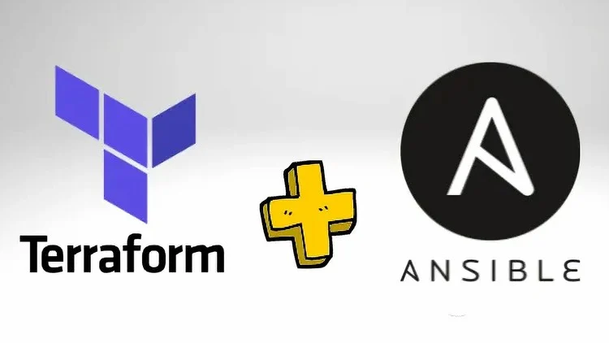

# 🛠️ PicBank Infrastructure as Code


This repository contains the **Infrastructure as Code (IaC)** setup for the **PicBank** project.
It provisions AWS resources using **Terraform** and **Ansible**, ensuring **scalability, security, and automation**.


---

## 📌 **Table of Contents**
- [📜 About the Project](#-about-the-project)
- [🚀 Features](#-features)
- [🛠️ Tech Stack](#-tech-stack)
- [📂 Project Structure](#-project-structure)
- [⚙️ Infrastructure Details](#-infrastructure-details)
- [🏗️ Setting Up the Environment](#-setting-up-the-environment)
- [🚀 Provisioning the Infrastructure](#-provisioning-the-infrastructure)
- [🧹 Destroying the Infrastructure](#-destroying-the-infrastructure)
- [🤝 Contributing](#-contributing)
- [📜 License](#-license)
- [📞 Contact](#-contact)

---

## 📜 **About the Project**
This project automates the provisioning of cloud infrastructure for **PicBank** using **Terraform** and **Ansible**.
It includes:
- **AWS Cognito** for authentication.
- **AWS SQS** for messaging.
- **AWS SES** for email notifications.
- **AWS ECS Fargate** for containerized deployment.
- **AWS S3 & DynamoDB** for Terraform state management.

---

## 🚀 **Features**
✅ **Automated AWS Infrastructure Provisioning**
✅ **Terraform State Management with S3 & DynamoDB**
✅ **AWS Cognito for Authentication**
✅ **AWS SQS for Asynchronous Messaging**
✅ **AWS SES for Email Notifications**
✅ **Infrastructure as Code (IaC) with Terraform & Ansible**
---

## **Tech Stack**
| **Technology** | **Description** |
|--------------|----------------|
| **Terraform** | Infrastructure as Code (IaC) |
| **Ansible** | Configuration Management |
| **AWS S3 & DynamoDB** | Terraform State Management |
| **AWS Cognito** | Authentication |
| **AWS SQS & SES** | Messaging & Email Services |
| **AWS ECS Fargate** | Containerized Microservices |

---

## 📂 **Project Structure**
```
picbank-infra/
│── ansible/
│   ├── playbook.yml              # Creates S3 & DynamoDB for Terraform state
│   ├── playbook-destroy.yml      # Destroys S3 & DynamoDB
│   ├── hosts                     # Inventory file for Ansible
│   ├── requirements.txt          # Ansible dependencies
│   ├── setup.cfg                 # Ansible setup configuration
│── terraform/
│   ├── backend.tf                # Terraform backend configuration
│   ├── environments/
│   │   ├── dev/                  # Terraform configuration for Dev environment
│   │   ├── prod/                 # Terraform configuration for Prod environment
│   ├── modules/                  # Reusable Terraform modules
│   │   ├── cognito/              # AWS Cognito User Pool
│   │   ├── ecr/                  # AWS ECR for container images
│   │   ├── ecs/                  # AWS ECS Fargate configuration
│   │   ├── iam/                  # IAM Roles & Policies
│   │   ├── network/              # Network-related modules
│   │   │   ├── internet-gateway/ # Internet Gateway configuration
│   │   │   ├── nacl/             # Network ACL configuration
│   │   │   ├── route-table/      # Route Table configuration
│   │   │   ├── security-group/   # Security Group configuration
│   │   │   ├── subnet/           # Subnet configuration
│   │   │   ├── vpc/              # VPC configuration
│   │   ├── ses/                  # AWS SES Email Configuration
│   │   ├── sqs/                  # AWS SQS Queues
│   ├── outputs.tf                # Outputs from Terraform
│   ├── providers.tf              # Terraform provider configuration
│   ├── variables.tf              # Variables used in Terraform
│── LICENSE                       # Project license
│── README.md                     # Documentation

```

---

## ⚙️ **Infrastructure Details**
The project provisions the following AWS resources:

- **S3 & DynamoDB**: Stores Terraform state.
- **VPC, Subnets, and Security Groups**: Network infrastructure.
- **IAM Roles & Policies**: Secure access to AWS services.
- **ECS Fargate**: Runs containerized microservices.
- **ECR**: Stores container images.
- **Cognito**: Manages authentication.
- **SQS**: Handles messaging queues.
- **SES**: Sends transactional emails.

---

## 🏗️ **Setting Up the Environment**

### **1️⃣ Install Dependencies**
Ensure you have the following packages installed:

- **Terraform** (`>= 1.6.0`)
- **Ansible** (`>= 2.15.0`)
- **AWS CLI** (`>= 2.0`)
- **Python** (`>= 3.8`)

> 🔎 **Verify Versions:**
```sh
terraform -v
ansible --version
aws --version
python3 --version
```

---

## 🚀 **Provisioning the Infrastructure**

### **1️⃣ Create S3 & DynamoDB for Terraform State (via Ansible)**
```sh
cd ansible
source ansible-venv/bin/activate
ansible-playbook -i hosts playbook.yml
deactivate
cd ..
```

### **2️⃣ Initialize Terraform**
```sh
cd terraform
terraform init
```

### **3️⃣ Validate Configuration**
```sh
terraform validate
```

### **4️⃣ Plan the Infrastructure**
```sh
terraform plan -out=tfplan
```

### **5️⃣ Apply and Create Resources**
```sh
terraform apply tfplan
```

### **6️⃣ View Outputs (Resource Information)**
```sh
terraform output
```

---

## 🧹 **Destroying the Infrastructure**

### **1️⃣ Remove AWS Resources (via Terraform)**
```sh
terraform destroy
```

### **2️⃣ Remove S3 & DynamoDB (via Ansible)**
```sh
cd ansible
source ansible-venv/bin/activate
ansible-playbook -i hosts playbook-destroy.yml
deactivate
cd ..
```

✅ Now all the infrastructure has been **removed**! 🧹

---

## 🤝 **Contributing**
Contributions are welcome! Feel free to submit pull requests or open issues.

1. Fork the project
2. Create a feature branch (`git checkout -b feature/new-feature`)
3. Commit changes (`git commit -m "Add new feature"`)
4. Push to the branch (`git push origin feature/new-feature`)
5. Open a Pull Request

---

## 📜 **License**
This project is licensed under the Apache License - see the [LICENSE](LICENSE) file for details.

---

## 📞 **Contact**
📘 **LinkedIn:** [linkedin.com/in/antoniocesarlopes](https://linkedin.com/in/antoniocesarlopes)
```
